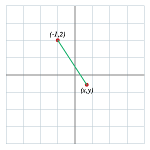

````
alias: Problem
layout: resource
clearance: 0
keywords: 
  - hedgehog
  - toast
  - daffodil
resourceType: RT3
stids1:
  - G2
stids2:
pvids1:
  - PI3
  - PI4
pvids2: 
  - PI1
  - PI2
priors:
  - missing
  - G2_RT7
  - G2_RT7
````

Here's some text.

Here's a useful picture.

<!-- ADD PICTURE OF AXES WITH THESE TWO POINTS MARKED AND A LINE SHOWING THE DISTANCE BETWEEN THEM -->



<div class="well">####Exercise

Here's an exercise.</div>

[<span class="icon-folder-open"></span> more here](../G2_RT7/index.html)
